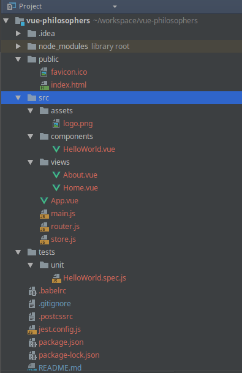

# Step 01 - Vue CLI and Single File Components

We have already generated the project using Vue CLI. Your project folder should look like this structure :


The goal of this step is to create your own single file component `Philosopher` inside the `src/components` folder.

Install the dependencies by running one of these commands :
```bash
npm install
#or
yarn install
```

Now run our newly created app with :

```bash
npm run serve 
```

Then go to `http://localhost:8080/`, you should see a nice welcome page.

## Todo

- Transform our "philosopher" component into a Single File Component (a.k.a SFC) called `Philosopher.vue`.
Look at HelloWorld.vue for an example.
- In `App.vue`, add a `<script>` part with an App component definition and some data :
```
data: function() {
        return {
            philosophers: [{
                img: require('../img/moss.jpg'), //use require to let webpack resolve relative paths
                name: 'Maurice Moss'
            },{
                img: require('../img/sheldon.jpg'),
                name: 'Sheldon Cooper'
            },{
                img: require('../img/goldblum.jpg'),
                name: 'Jeff Goldblum'
            }]
        }
    },

```
Then display our philosophers with the Philosopher component, just like in step00. You can display it right under
the `<div id="nav">` or the `<router-view/>`, we will come to it later.
- Note : Don't forget to import and declare the `Philosopher` component in `App.vue` as it is no longer declared as global.
```
import Philosopher from "./components/Philosopher";

export default {
        name: "App",
        components: {Philosopher},
}        
```

## Focus

- Note the 3 elements to create a vue component : `<template>`, `<script>`, `<style>`
- The `<template>` can only have one root element 
- Take some times to look at the different files generated in the `src` folder. Try to identify the parts
you can see in the page at `http://localhost:8080/`.
- `main.js` is the entry point of the application, it creates the Vue.js instance.
- `App.vue` contains the root component and include the routing entry point (we will see more about that later)

## (Optional) Start from scratch

Let's create a project from scratch using the Vue CLI.

Start by installing the CLI :

```bash
# you may need to use sudo in front of these command lines
npm install -g @vue/cli
# or
yarn global add @vue/cli

```

Using the command `vue create` create a project named `vue-philosophers`. You can use this command 
in the same folder you used to call `git clone` and select `merge` when the prompt ask for the 
target directory. It will add the specific files and let our README and .gitignore files.

The project must be configured with :
 - Router
 - Vuex
 - CSS Pre-processors -> choose Sass
 - Unit testing -> choose Jest
 - choose to place config files in dedicated files

Don't worry, we will explain each of these concepts later in the workshop.

If everything went well, you should see a files structure like this :


 
